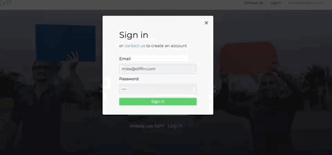

# ExP

[Live Link](http://experience-premier.herokuapp.com/#/)

## Background & Overview

ExP is a customer service management platform that provides employee performance data based on customer interaction records. When an employee completes a call, they will be able to submit transcripts or live conversation recordings, which will then be sent to the back-end. Data will then be passed to IBM Watson’s text analysis API for sentiment analysis, which in turn will be returned to the application frontend to be visualized. 

Managers, executives, and HR representatives will be able to view the resulting data to assess each employee’s performance and customer satisfaction. Employees can view their own data as well.

## Technologies

`HTML5` / `SCSS` / `MongoDB` / `Express.js` / `React.js` / `Redux` / `Node.js` / `JavaScript` / `Chart.js` / 
`IBM Watson's API` / `Animate CSS`

## Features
Employee login displays their own data and previous calls. They can select a specific call and display that call's data.

Manager login displays their team's data as well as the manager's previous calls. Manager can click on an employee to render the view the employee's data.

Employees and Managers can both record a call or a conversation

## Possible Future Implementations
+ Allow a user to submit text as well. This could include emails, speeches, presentations and live chats
+ Implement feature that allows managers to filter team data based on year, month, week, or day.
+ Expand positions above just a manager of a team. Display the data of entire branches and companies. Compare that data to data from companies within the same Industry.

## Team Members
Seungho Victor Yang, Nick Matison, Mark Lee, Jordan Yu
